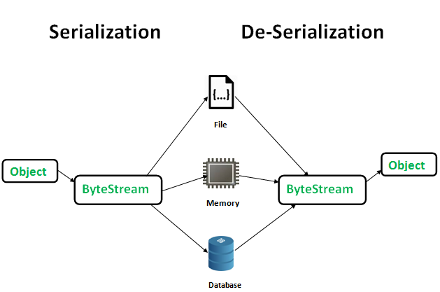

关键字：
- java.io.Serializable(interface)
- java.io.ObjectOutputStream(class)
- java.io.ObjectInputStream(class)

序列化相关的工具类：
- [org.apache.commons.lang3.SerializationUtils](https://commons.apache.org/proper/commons-lang/javadocs/api-3.1/org/apache/commons/lang3/SerializationUtils.html)

图片引用地址：https://www.geeksforgeeks.org/wp-content/uploads/gq/2016/01/serialize-deserialize-java.png

- https://www.geeksforgeeks.org/serialization-in-java/
- https://docs.oracle.com/javase/7/docs/api/java/io/Serializable.html
- 《Java编程思想第四版完整中文高清版.pdf》 10.9 对象序列化
